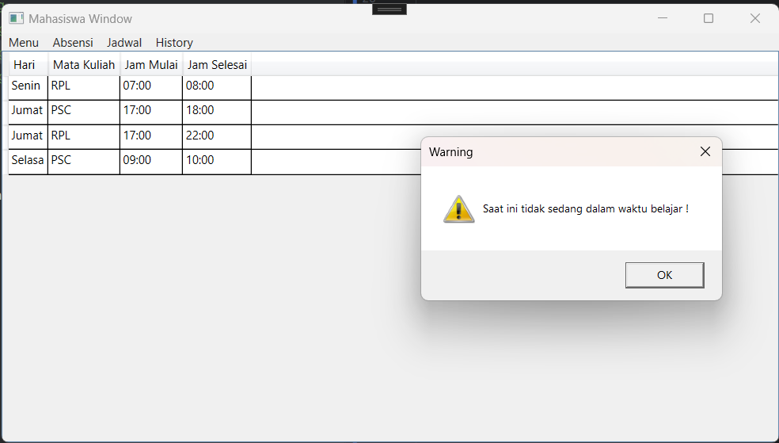

# WPF Absen Application with MongoDB 🍃
## 🔎 About
This project is for completing Pemrograman Dekstop and Embedded Matakuliah at UIN Sunan Kalijaga Yogyakarta.

## </> Developer
Name    : Muammar Mufid Darmindra  
NIM     : 2110605007

## 🚀 Deployment
1. Copy this repository to your Machine
2. Build
3. Run

## ✨ Feature
This app made with 3 level user, Admin, Mahasiswa, and Dosen. 
If you don't have MongoDB Sever run on your machine, you can still use this app by using provided hosted database.
1. Admin

- Add new Matkul to Matkul Collection
- Delete Matkul 
- Update Makul
- Add new User
- Update an Delete user
- Assign Matkul to User
- Update Absensi for Mahasiswa and Dosen
- Read all Absensi Data

2. Mahasiswa

- Read Assigned Matkul
- Read history Absensi
- Update current Matkul Absensi
- Independent Absensi Feature

3. Dosen
- Read Assigned Matkul
- Read history Absensi
- Read Matkul Collection
- Update Mahasiswa Absensi
- Independent Absensi Feature

## 🖼️ Images
1. Login Window

2. Admin Window

- 
- 
- 
- 

3. Mahasiswa Window

- 
- 
- 
- 

4. Dosen Window

- 
- 
- 

5. Other 

-

## 🎫 License
This project license is in [here](LICENSE.txt)